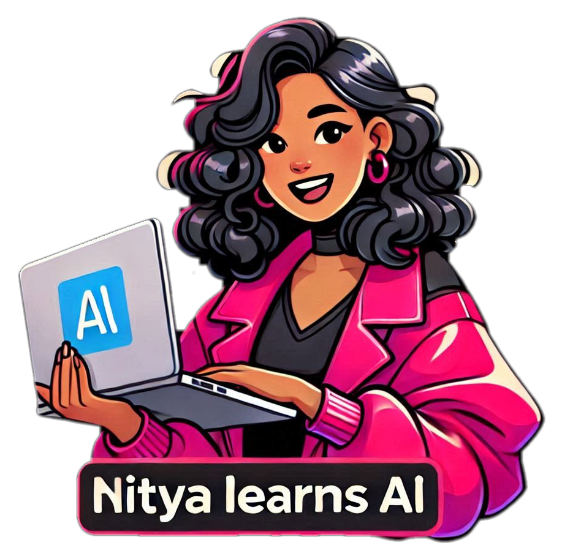

# Hello, I'm Nitya!

I'm a PhD and Polyglot with over three decades of experience in software research, development & advocacy spanning industry and academia. My prior background was in distributed systems, ubiquitous computing, mobile & web development but my more recent work has focused on cloud, data and AI. 

I am currently a Senior AI Advocate at Microsoft where I act as "developer 0" for our product teams, building prototypes, providing feedback, and creating content and samples to educate and empower our developer communities to build intelligent apps productively, on Azure.

**Nitya Learns AI** is my effort to help myself and others explore this fascinating and fast-moving ecosystem with a sense of actionable curiosity rather than fear and fatigue. Let's try things out, make mistakes, build apps, and break them apart. In doing so, we'll figure out how tools and technologies work and learn to harness those insights in creative & productive ways.

It's time to put the fun back in fundamentals. Join me!

_Image Credit: Microsoft Designer_
